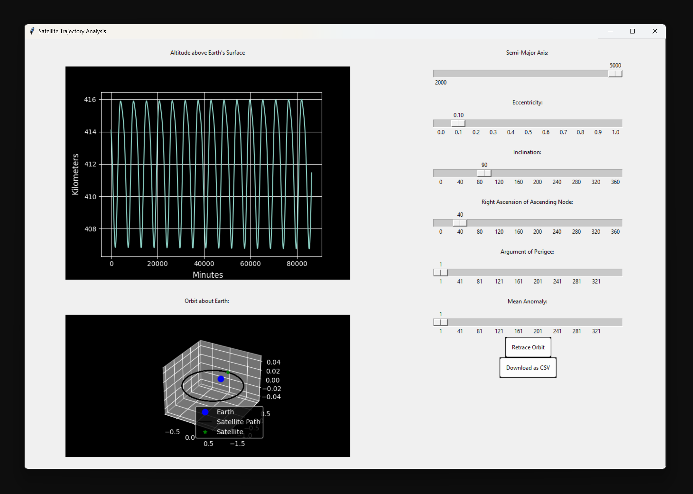

# Satellite Trajectory Analysis GUI

## About 
Desktop Python simulation app to calculate and predict a satellite’s orbit using PyAstronomy’s Kepler Ellipse model.




## Exec file
[finalProject/satelliteGUI.py](https://github.com/igdaniel-1/aerospaceProg-unit5/blob/main/finalProject/satelliteGUI.py)


## Install Instructions
The files in this repository have dependencies including: tkinter, matplotlib, scipy, sv_ttk, PyAstronomy, sgp4.

Matplotlib, scipy, sv_ttk, PyAstronomy, and sgp4 were installed in a virtual environment in the folowing manner.

### Mac Install

1. Set up the virtual environment. To start a VM named 'keplerVM', open a terminal within your project directory and enter:

```python3 -m venv keplerVM  ```

2. Activate the environment, telling your computer to "look there" for the files.

```source keplerVM/bin/activate ```


3. Install the dependency in the new virtual environment:

```pip3 install matplotlib```

4. Check your install

```pip3 list```

5. When you're done, deactivate the virtual environment

```deactivate```

6. To restart the environment, repeat step 2 within your project directory

### Tkinter install
This install was giving me issues with pip so I used brew for Mac installs. 

```brew install python-tk```

### Windows Install
I handled Windows execution using Anaconda to create the virtual environment.
1. Open Anaconda Prompt 
2. In Anaconda Prompt, create a new development environment named 'keplerVM' by running:

```conda create --name keplerVM python=3.9```


3. In Anaconda Prompt, activate the new environment:
```conda activate keplerVM```

4. Open the development directory in VS Code. In the bottom-right corner of the IDE's GUI is the environment button (to the left of the little bell.) Click and change the env to your 'keplerVM'.

If the name of the environment does not appear, restart VS Code. It should display 'keplerVM' in the bottom-right now.

IF NOT: "Click into" finalProject/finalProject.py file that you intend to execute within the VS Code IDE. Run the file by running (or by clicking Run):

```cd /aerospaceProg-unit5/finalProject/```

```python3 [LOCAL/PATH/TO/REPO]/aerospaceProg-unit5/finalProject/satelliteGUI.py```

A GUI should appear on your display.

To check if you're in the env, the cmdl should look like:
```(keplerVM) C:\Users\<YourName>>```

5. For general installs (e.g. PyAstronomy), use cmdl:
```pip install <library>```
For conda installs:
```conda install --channel conda-forge <library1> <library2>```


6. At the end of your development, shut down the environment. In Anaconda Prompt, deactivate the new environment:
```conda deactivate```